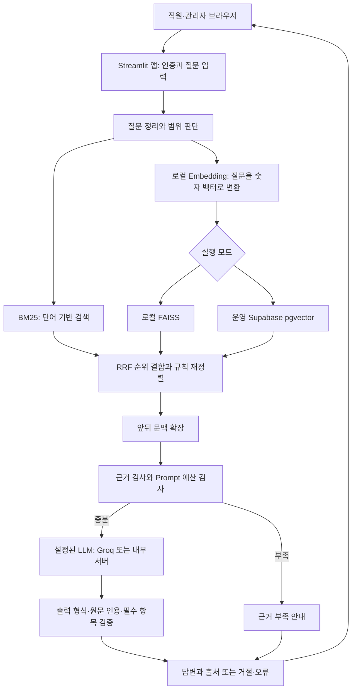

# 시스템 아키텍처 설계서

기준일: 2026-09-17 · main `8c44851` + 기존 UI 변경 · 현재 구현 설명

## 1. 전체 구조

웹 화면과 질문 처리 코드는 같은 Python/Streamlit 앱에서 실행된다. 독립된 Frontend 서버와 REST Backend 서버로 분리된 구조는 현재 없다. RAG는 ‘문서에서 근거를 찾은 뒤 그 근거를 사용해 답변하는 과정’이다.

위는 현재 실행 경로다. ChromaDB는 확인되지 않아 동작 중인 구성 요소로 그리지 않았다. 프로젝트 차원에서 비교하려는 Version B의 연결 구조는 해당 브랜치 확인 후 이 정본의 Retrieval 절에 추가한다.

## 2. 모듈 역할

| 영역 | 코드 | 책임 |
|---|---|---|
| 진입 | `streamlit_app.py`, `mvp/app.py` | 앞 파일은 실제 앱 실행 연결. 앱은 로그인·세션·질문 처리 순서와 화면 조정 |
| 화면 | `ui.py`, `ui.css`, `answer_ui.py`, `admin_ui.py`, `checklist_ui.py`, `diagnostic_ui.py` | 입력·결과·관리·진단 표시 |
| 설정 | `settings.py` | `mvp/.env` → Streamlit Secrets → 환경변수 순으로 덮어 적용. 비밀 값은 문서화하지 않음 |
| 인증 | `auth.py`, `cloud.py` | 로컬 계정/세션 또는 Supabase 사용자 JWT 및 회원 권한 재확인 |
| 로컬 저장소 | `repository.py` | SQLite 문서 상태·chunk·벡터, corpus 버전, 검색 스냅샷·락 |
| 운영 저장소 | `cloud_repository.py`, `cloud.py` | 사용자 권한에 따른 REST/RPC 접근, 운영 BM25 캐시·pgvector 검색 |
| 원본 저장 | `storage.py` | 로컬 파일 또는 Supabase Storage 객체 읽기·쓰기·삭제 |
| 문서 처리 | `documents.py`, `pdf_layout.py`, `structure.py`, `library.py` | 추출·표·선택 OCR·의미 블록·chunk·임베딩 |
| 질문·검색 | `query.py`, `medical_terms.py`, `retrieval.py`, `context.py` | 질의 정리, 별칭, BM25·FAISS·순위 결합·문맥 |
| 답변·검증 | `ai.py`, `evidence.py`, `grounding.py` | 근거 충분성·입력 예산·사용량·LLM·인용·충돌 검사 |
| 진단·평가 | `diagnostics.py`, `search_trace.py`, `evaluate.py`, `evaluate_cases.py` | 실제 검색 단계 관찰과 CLI 평가 |
| 운영 보조 | `operations.py`, SQL 파일·migration | 로컬 백업, 운영 스키마·접근 정책 |

`preview.py`에는 업로드 상태 보조 코드가 있지만 현재 관리자 화면은 별도 원본 PDF 뷰어를 제공하지 않는다. 파일 존재만으로 화면 구현을 판정하지 않는다.

## 3. 실행 모드와 저장 위치

| 항목 | local | staff |
|---|---|---|
| 접속 전제 | loopback에서 실행 | Supabase URL·publishable/anon 연결 설정 |
| 인증 | `accounts.sqlite3` | Supabase Auth + `guide_profiles` |
| 문서·chunk | `catalog.sqlite3` | `guide_documents`, `guide_chunks` |
| Vector 검색 | 메모리 FAISS IndexFlatIP | `guide_search` RPC / pgvector |
| BM25 | 서버의 검색 스냅샷에서 메모리 인덱스 | 직원 세션별 허용 chunk 메모리 인덱스 |
| 원본 | 기본 `data/library/originals` | 운영 권장: 비공개 Supabase Storage. 저장소 선택은 설정에 따름 |
| LLM 사용량 | `data/usage.sqlite3` | 이 모드도 앱 서버의 `data/usage.sqlite3` 사용 |

로컬 기본 라이브러리 경로는 `data/library`이며 설정으로 변경할 수 있다. 두 실행 모드는 Retrieval 비교 버전 A/B와 다른 개념이다. local=BM25, staff=ChromaDB로 대응시키지 않는다.

## 4. Retrieval 구현 버전

### BM25 기반 영역

- 상태: 현재 main에서 구현 확인. 실제 앱은 BM25 단독이 아니라 Hybrid다.
- 검색 방식: 허용된 chunk의 본문·section을 BM25로 점수화하고 Vector 후보와 RRF로 결합.
- 관련 모듈: `retrieval.py::BM25Index/search/rrf/rerank`, `cloud.py::StaffLibrary.search`.
- 별도 순수 BM25 일괄 평가 구현·문서는 `origin/codex/two-stage-rag-plan`에서 관리. 현재 main에서 같은 기능을 제공한다고 보지 않는다.

### ChromaDB 기반 영역

- 상태: 현재 브랜치에서 미구현. 다른 담당 브랜치의 구현 여부는 확인 필요.
- Vector Store: 프로젝트가 지정한 비교 대상은 ChromaDB. 실제 collection·영속 경로·거리 함수·버전 확인 필요.
- Embedding: 해당 버전의 모델과 입력 방식 확인 필요. 현재 main의 모델을 그대로 사용한다고 추측하지 않음.
- 관련 모듈: 현재 브랜치에서 확인되지 않음.

## 5. 상태·권한·오류 처리

- 로그인 객체와 최대 8턴 대화는 Streamlit 세션에서 관리한다. 권한·문서 revision·검색/AI 버전·모델 등 scope 변경 시 대화를 비운다.
- 임베딩 모델은 서버에서 공유한다. 로컬 검색 스냅샷은 catalog 경로·corpus 버전으로 캐시하고 검색 락으로 보호한다.
- 운영 BM25 캐시는 사용자·문서 ID·파일 해시·색인 시각·개정일 등에 따라 재사용한다. 직원마다 전체 허용 chunk를 보유하므로 동시 사용자 증가에 따른 메모리는 측정 필요하다.
- 처리 중 권한·문서 버전을 재검사한다. 원문 보기에도 버전 검사가 있다.
- LLM 사용량은 SQLite에서 예약·정산한다. 여러 서버가 서로 다른 로컬 파일을 쓰는 배포에서 전역 한도를 공유하는 구조는 확인되지 않는다.
- API 요청은 자동 재시도·유료 대체 모델 전환을 하지 않는다. 안전한 사용자용 오류를 반환한다.

### 문서 교체의 실제 차이와 한계

로컬은 새 색인과 기존 문서 제외·체크리스트 비활성화·corpus 증가를 DB 트랜잭션으로 반영한다. 색인 실패 시 기존 ready 문서를 유지하는 경로가 있다.

운영은 새 원본 저장 → `guide_publish` → 기존 문서 `retire` → 기존 원본 삭제로 나뉜다. `publish` 성공 뒤 후속 단계 실패 시 새 원본 삭제가 실행될 수 있으며 DB 게시를 함께 되돌리는 계약은 확인되지 않는다. 또한 게시 요청의 응답 유실도 별도 확인이 필요하다. 따라서 두 구현의 원자적 교체가 동일하다고 기술하지 않는다. 코드상 위험을 기록한 것이며 실제 장애 재현·수정은 이번 범위 밖이다.

## 6. 배포·외부 경계

- 운영 DB 초기 구성은 루트 README에 기재된 `schema.sql`, `storage_schema.sql`, `migrations/20260910_operational_pgvector.sql` 순서를 따른다. 이번에 실행하지 않았다.
- RLS는 사용자별 허용 행을 제한하는 DB 정책이다. 관리자용 service_role 키는 앱 설정에서 거절한다.
- 모델 최초 다운로드를 제외한 문서·질문 Embedding은 로컬 CPU에서 수행한다. LLM이 활성화되면 선택 근거와 질문이 설정된 서버로 전송된다.
- 실제 배포 URL·가용성·부하·운영 데이터·migration 적용 상태는 확인 필요다.

근거: [앱](../../mvp/app.py), [설정](../../mvp/settings.py), [로컬 저장소](../../mvp/repository.py), [운영 저장소](../../mvp/cloud_repository.py), [운영 연결](../../mvp/cloud.py), [원본 저장소](../../mvp/storage.py), [AI](../../mvp/ai.py), [배포 안내](../../README.md).
